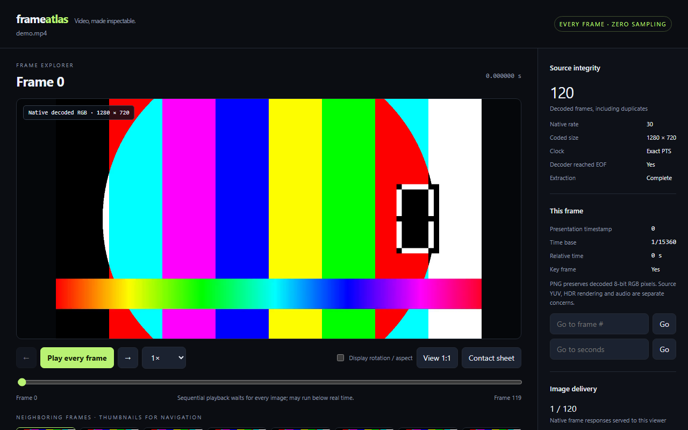

# FrameAtlas 🌱

**Every video frame, accessible to AI agents and humans.**

FrameAtlas decodes a local video into a complete, indexed collection of native-resolution PNG images with exact presentation timestamps. Its MCP server returns actual images in ordered batches, while its browser viewer lets you step through each frame, compare neighboring images, and navigate a contact sheet.

**300 seconds × exactly 60 FPS = 18,000 frames. All 18,000 remain addressable.**
The decoder determines the actual count: 59.94 FPS and variable-frame-rate videos can have different counts. FrameAtlas never forces a video to 60 FPS, deduplicates repeated images, or samples one frame per second.


*The browser viewer on a generated 4-second test video (120 frames at 30 FPS).*

## About

FrameAtlas is a Python command-line tool and MCP server for people who want an AI agent (or a human reviewer) to look at every frame of a video instead of a sampled subset. It extracts frames locally with PyAV, records exact timestamps, serves them over MCP and a browser viewer, and tracks which frames a review session has actually seen. It is an early release (version 0.1.0), installable from this repository.

## Install

Python 3.10 or newer. Install directly from this repository:

```sh
python -m pip install "git+https://github.com/fizzexual/frameatlas.git"
```

Or clone for development:

```sh
git clone https://github.com/fizzexual/frameatlas.git
cd frameatlas
python -m venv .venv
# Windows: .venv\Scripts\activate
# macOS/Linux: source .venv/bin/activate
python -m pip install -e ".[dev]"
```

[PyAV](https://pyav.org/docs/stable/) provides the FFmpeg decoder; its supported wheels include FFmpeg libraries. A separate `ffmpeg` executable is not needed. On platforms without wheels, PyAV may need a compiler and compatible FFmpeg development libraries. No AI API key, hosted service or model download is required.

## Extract and inspect

```sh
frameatlas extract video.mp4 --output datasets/my-video
frameatlas verify datasets/my-video
frameatlas serve datasets/my-video --port 8765
```

Open **http://127.0.0.1:8765/**. Use left/right arrows to move exactly one frame, jump to a frame index or source timestamp, inspect at 1:1 scale, or play every frame in sequence. Playback waits for image loading and can run below real time; it never skips ahead to conceal slow decoding or image delivery. Browser rendering itself is not an independent proof of visual attention.

Other commands:

```sh
frameatlas info datasets/my-video
frameatlas frames datasets/my-video --start 17992 --count 8
frameatlas frame datasets/my-video --index 17999
frameatlas frame datasets/my-video --time 299.983333
frameatlas sheet datasets/my-video --start 0 --count 32 --output overview.png
frameatlas coverage datasets/my-video --session agent
```

Frame indices are **zero based**. `frame` and `frames` return metadata, not image delivery. `sheet` creates an overview outside the dataset. Source files are never copied into the dataset or sent to a hosted service by this tool. PNG extraction can require much more disk space than the compressed video. The default free-space reserve is 256 MiB, checked every 64 frames; adjust it with `--reserve-mib`. Existing nonempty outputs are refused. Handled interruptions are marked incomplete; a forced process termination can leave the status as extracting. Neither status can be opened as a completed dataset. Choose a new output to restart.

## Connect an AI agent through MCP

Run the stdio server against one completed dataset:

```sh
frameatlas mcp /absolute/path/to/datasets/my-video
```

Add it to your MCP-capable agent's configuration using that client's documented configuration format. A common JSON form is:

```json
{
  "mcpServers": {
    "frameatlas": {
      "command": "frameatlas",
      "args": ["mcp", "/absolute/path/to/datasets/my-video"]
    }
  }
}
```

If the host cannot find `frameatlas`, use an absolute Python interpreter path as `command` and `args: ["-m", "frameatlas", "mcp", "/absolute/dataset"]`. Windows paths in JSON need escaped backslashes or forward slashes. The host must support MCP **image content**; a text-only client will not let the agent see frames.

| Tool | Purpose | Counts as individual image delivery? |
| --- | --- | --- |
| `dataset_info` | Actual count, native rate, dimensions and extraction status | No |
| `list_frames` / `frame_at_time` | Ordered metadata or nearest exact timestamp | No |
| `get_frame` | One verified PNG; optional preview, crop or display transform | Whole images only; crops are separate |
| `get_batch` | Every consecutive frame, as individual images; 1–8 per call | Yes |
| `get_contact_sheet` | Labeled thumbnails for navigation | No |
| `compare_frames` | Two images and absolute RGB difference | No |
| `record_observation` | Explicit note about already delivered frames | Agent declaration only |
| `review_coverage` | Native/preview counts, observation gaps and resume indices | No |

Native images are the default. Each image is bounded to 10 MiB; batches are bounded to 20 MiB of raw PNG data before base64 encoding. Oversized requests fail before delivery accounting. Use smaller batches, `max_width` previews, or `region: [x, y, width, height]` tiles to inspect large frames. A crop or preview never becomes a native whole-frame delivery in the ledger. Hosts may resize images or impose lower payload limits; the server cannot verify their display resolution.

An example instruction for your agent:

> Inspect this entire video frame by frame. First get dataset_info and review_coverage with session "analysis-1". Request get_batch at native resolution, starting with the first unobserved frame, in consecutive batches of at most 8. Examine every returned image and save concrete notes with record_observation for the exact examined range. Resume from the coverage gaps after interruptions. Use contact sheets only for navigation. Report native-delivery coverage and observation coverage separately; do not describe unreviewed frames as reviewed.

Read [the exhaustive review guide](docs/agent-review.md) for timing, motion analysis and resumption. A five-minute 60 FPS video needs at least **2,250 eight-image calls** for one full native delivery pass. Model context limits still apply: the purpose is complete sequential access, not placing 18,000 images in one prompt. This package does not invoke Codex or any other model automatically; your agent drives the tools.

## What “every frame” guarantees

- Pixels and PTS come from the **same decoded AVFrame**. EOF flushes buffered frames. Original rational timestamps are kept, including nonzero start times, variable intervals and repeated timestamps.
- Every emitted frame gets its own PNG and index entry, including identical images. There is no temporal resampling, deduplication, interpolation or extraction resize.
- PNGs preserve **decoded 8-bit RGB coded pixels**. RGB conversion is not lossless to the original YUV/compressed bitstream. HDR tone mapping, source audio, interlaced-field reconstruction and human-equivalent perception are outside this version's scope. Rotation and sample aspect ratio are exposed separately; optional display transforms are labeled.
- Completeness means decoder EOF, no marked corrupt frames, nondecreasing valid PTS, and agreement with declared stream frame counts when present. This cannot prove frames already missing from a damaged source exist. A decoder can conceal damage without signaling corruption.
- Source SHA-256 is checked before and after extraction. Every native PNG and RGB byte sequence has a hash. `verify` checks all images, thumbnails, rational timestamps and agreement between JSONL and SQLite.
- Missing timestamps, backwards PTS, decoding failures, low disk space, source mutations or count mismatches produce an **incomplete dataset**, never a fabricated timestamp or successful certificate.

Coverage stores image responses served and agent-written notes in separate tables and sessions. It does not measure whether a model paid attention, understood the content or saw the video as a human would. Only `native_delivery_and_declared_review_complete` requires both all native whole-frame responses and all observation declarations. Viewer activity is separate from agent sessions.

## Dataset layout

```text
my-video/
  manifest.json          # completion status, source hash, clocks, decoder versions
  frames.jsonl           # exact per-frame metadata in presentation order
  index.sqlite           # indexed random/time access
  frames/00000/000000000.png
  thumbnails/00000/000000000.jpg
  coverage.sqlite        # created by MCP/viewer; deliveries and declared notes
```

Paths are relative and checked against the dataset root. Each image response verifies the native PNG hash first. The browser server binds only to loopback and exposes indexed files through fixed routes. MCP receives the dataset at startup; tools cannot choose arbitrary source paths, execute shell commands or access a remote URL. The local viewer is intended for a trusted machine and is not a multi-user hosted service.

## Development and validation

```sh
python -m pytest -q
python -m pytest -q --run-scale tests/test_scale.py
python -m build
```

The opt-in scale test generates a **300-second, exactly 60 FPS video with 18,000 frames**, extracts and verifies all of them, then receives every frame through MCP in consecutive batches and validates image pixels. It uses small synthetic images so it is practical in CI. It tests coverage and counts, not 1080p throughput or model reasoning quality. [Validation details](docs/validation.md).

CI runs the normal suite on Linux, macOS and Windows, plus a dedicated 18,000-frame check on Linux. No proprietary video, generated datasets or credentials are included in this repository.

## License

[MIT](LICENSE). Video content remains subject to its own ownership and permissions.
